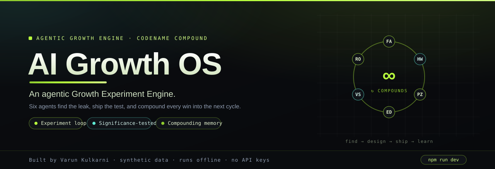

<p align="center">
  
</p>

# AI Growth OS — an agentic Growth Experiment Engine

    

**Part of the [AI PM Agent Showcase](https://github.com/varunk130/ai-pm-portfolio)** — five standalone agentic apps · App 1 of 5.

> Founding growth isn't campaigns. It's a **compounding experiment loop**. Compound runs that loop end-to-end — and shows its work.

A standalone, production-quality demo of a **real in-app multi-agent runtime** (codename **Compound**). Six named agents find a funnel leak, design an experiment, write a shippable asset, and call the result with a significance test — then compound every learning into the next cycle. It runs **completely offline**: no API keys, no external LLM calls, nothing to configure.

**Stack:** Next.js 14 (App Router) · TypeScript · Tailwind · framer-motion · recharts · lucide-react · @faker-js/faker (seed only)

---

## What this demonstrates

Compound shows that an agentic system can run a genuine growth loop with **real computation, not theater**: funnel math, ICE prioritization, two-proportion sample sizing, and a z-test/p-value readout are all computed live on a synthetic dataset. The signature **Agent Trace** makes the multi-agent execution watchable on two levels at once — a plain-language layer ("what this agent figured out and why it matters") and a technical layer (agent, tool calls, structured result). And because every shipped win is written to **compound-memory** and folded into the growth model, the loop visibly gets smarter on each cycle.

---

## Run it

```bash
npm install
npm run dev      # http://localhost:3000
```

Then open **/demo** and hit **Run guided demo**. To regenerate the dataset:

```bash
npm run seed     # rewrites data/funnel.json deterministically
```

Build for production (Vercel-ready, **zero environment variables**):

```bash
npm run build && npm start
```

---

## 60–90s spoken walkthrough script

> "This is **Compound** — an agentic growth experiment engine. The thesis: early-stage growth isn't campaigns, it's a compounding experiment loop. And this runs entirely in the browser — no API keys, nothing to configure.
>
> I'll type a real goal: *'WAU is flat this week — find the leak and run the next experiment.'* Watch the **Agent Trace** on the right.
>
> The **Loop** orchestrator checks its memory and dispatches. The **Funnel Analyst** queries 60 days of real data and finds the biggest leak by modeled WAU impact — an **activation cliff**: only 31% of signups make a first API call, against a 55% benchmark. The **Hypothesis Writer** proposes eight testable bets. The **Prioritizer** scores them with real ICE math and picks the winner. The **Experiment Designer** sizes the test — sample size and runtime — with a real two-proportion calculation. **Variant Studio** assembles the actual asset: here's a genuine onboarding email, real usable copy. And **Readout** simulates a result, runs a z-test, and makes the call: a 20% lift, p under 0.001 — **ship it**.
>
> Now the payoff. That win is written to **compound-memory**, and the modeled WAU jumps. I hit **Run another cycle** — and because Compound remembers, it *skips* the leak it already fixed and finds the next one: leaky week-2 retention. The WAU projection compounds again.
>
> Every score is real math, every asset is real copy, and the whole thing runs offline. That's the loop."

---

## Architecture summary

A goal enters the **Orchestrator (Loop)**, which plans a cycle and dispatches six typed sub-agents over an observable message bus. Sub-agents invoke **named skills** that read and compute over a **local synthetic dataset** (`data/funnel.json`) and a **curated content library** (`content/`). Two kinds of output, both key-free:

- **Analytical** (leak ranking, ICE, sample size, significance test) = genuine deterministic computation in `src/lib/{analytics,stats}.ts`.
- **Generative** (hypotheses, shippable assets) = selected/assembled from the scenario-specific library in `content/`, routed through a single LLM seam (`src/lib/llm.ts`).

The backwards edge — **compound-memory** — feeds each Readout into the next Loop, which is what makes growth compound.

```
Goal → Loop (orchestrator)
        ├─ Funnel Analyst    → funnel-query     ┐
        ├─ Hypothesis Writer → content:hypotheses│
        ├─ Prioritizer       → ice-score        │ read/compute over
        ├─ Experiment Designer → experiment-stats│ data/funnel.json + content/
        ├─ Variant Studio    → llm-seam + content│
        └─ Readout           → experiment-stats  ┘
   ↑________________ compound-memory ____________↓   (the compounding edge)
```

### Project structure

| Path | What's there |
| --- | --- |
| `data/seed.ts` → `data/funnel.json` | Deterministic seed generator + committed sample (60 days, 4 channels, cohorts, 3 injected problems) |
| `src/lib/` | `analytics` (funnel math, leak ranking, growth model), `stats` (sample size, z-test), `dataset`, `llm` (the seam), `format` |
| `src/skills/` | Named, reusable skills the orchestrator invokes by name |
| `src/agents/` | `orchestrator` (Loop) + six typed sub-agent modules + trace types |
| `content/` | Curated hypotheses, shippable assets, guided-demo narration |
| `src/components/demo/` | Agent Trace, growth widget, ICE table, variant preview, readout, projection chart, learnings library |
| `src/app/` | Home · Problem→Solution · How it works · Live demo · Results |

---

## Agents & skills

### Agents
| Agent | Role | What it does |
| --- | --- | --- |
| **Loop** | Orchestrator | Owns the WAU goal, plans the cycle, dispatches sub-agents, compounds learnings. |
| **Funnel Analyst** | Analysis | Queries the dataset and ranks leaks by modeled WAU impact. |
| **Hypothesis Writer** | Generative | Proposes testable bets that target the leak (from `content/`). |
| **Prioritizer** | Analysis | Scores bets by ICE (Impact × Confidence × Ease) and picks the winner. |
| **Experiment Designer** | Analysis | Sizes the test: metric, two-proportion sample size, runtime. |
| **Variant Studio** | Generative | Assembles the actual shippable asset via the LLM seam. |
| **Readout** | Analysis | Runs a real significance test on a simulated result and calls ship/kill. |

### Skills (reusable, invoked by name)
| Skill | One-liner |
| --- | --- |
| `funnel-query` | Computes stage conversions, ranks leaks vs benchmarks, surfaces channel efficiency. |
| `ice-score` | Computes and ranks ICE scores to pick the next experiment. |
| `experiment-stats` | Two-proportion sample size + z-test / p-value / 95% CI. |
| `compound-memory` | Persists learnings and feeds them into the next cycle — the compounding. |

---

## Optional LLM adapter (how to enable a real model later)

The app is fully functional with **zero** model calls. Generative agents call one seam, `agentLLM.generate()` (`src/lib/llm.ts`), which by default selects deterministically from the curated `content/` library. To route generation through a real model (e.g. **Claude Opus 4.8**) later, register an adapter once at startup — no other code changes:

```ts
import { configureModelAdapter } from "@/lib/llm";

configureModelAdapter(async (req) => {
  // req.task, req.context (the data the agent just analyzed), req.candidates
  const res = await fetch(process.env.MODEL_URL!, {
    method: "POST",
    headers: { Authorization: `Bearer ${process.env.MODEL_KEY}` },
    body: JSON.stringify({ prompt: buildPrompt(req) }),
  });
  return (await res.json()).text;
});
```

The seam returns a `source` (`curated-library` | `model`) that surfaces in the trace, so provenance stays visible. **The app never requires this** and ships without it.

---

## Swap synthetic data for a real source

The runtime only depends on the typed shape in `src/lib/dataset-types.ts` (`FunnelData`). To use real data:

1. Produce a `FunnelData` object from your warehouse/analytics (daily signups, activation events, WAU, weekly cohorts, channel spend/CAC) — for example a small ETL that writes `data/funnel.json`, or a server route that returns the same shape.
2. Point `src/lib/dataset.ts` at it (replace the JSON import).
3. Adjust `benchmarks` in the seed/data to your category's healthy reference rates.

Everything downstream — leak ranking, ICE, stats, the growth model, the agents — is data-source-agnostic and keeps working.

---

## Notes

- **Offline by design:** no API keys, no network calls at runtime. Deploys to Vercel with no env vars.
- **Accessibility:** keyboard navigable, visible focus, AA contrast, `prefers-reduced-motion` respected (animations and stagger collapse to instant).
- **Determinism:** the dataset and the agent loop are seeded, so the demo reproduces exactly.

---

## Related apps

Part of a five-app multi-agent showcase, all offline and key-free:

- [ai-customer-acquisition](https://github.com/varunk130/ai-customer-acquisition) — **Beacon**, an agentic paid-acquisition engine with live reallocation
- [ai-revops](https://github.com/varunk130/ai-revops) — **Atlas**, GTM + Partnerships + RevOps into one Vertical Launch Plan

Built by **Varun Kulkarni** · synthetic data · for an internal AI-upskilling showcase.

